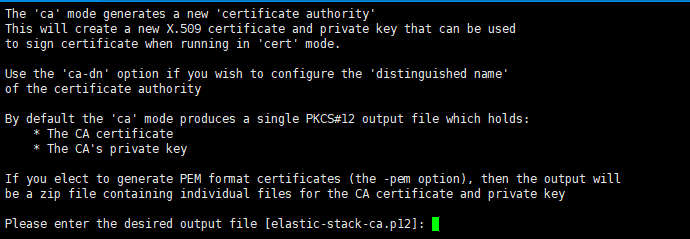

# 1.8 Elasticsearch 보안 설정

외부에서 접속,호출을  하기 위해서는 인증 절차를 통한 로그인이 필요하다.

## 1. 인증키 생성

### 1.1 공개키 생성

```
cd /home/ericasearch1/es-715/
bin/elasticsearch-certutil ca
```

<figure><figcaption></figcaption></figure>

1\) enter 입력 (파일명 변경하지 않음)

2\) 공개키 비밀번호 입력 :&#x20;

3\) elastic-stack-ca.p12 파일 생성 완료

4\) 확인

<figure><figcaption></figcaption></figure>

### 1.2 대칭키 생성

1\) certs 폴더 생성 (config 폴더 하위)

```
cd /home/ericasearch1/es-715/config
mkdir certs
```

<figure><figcaption></figcaption></figure>

2\) 대칭키 생성  (한줄씩 복사하여 붙여넣기)

```
cd /home/ericasearch1/es-715/
bin/elasticsearch-certutil cert \
--ca elastic-stack-ca.p12 \
--dns localhost \
--ip 127.0.0.1 \
--out config/certs/es-cluster.p12
```

3\) 비밀번호 2회 입력

<figure><figcaption></figcaption></figure>

4\) 생성완료

<figure><figcaption></figcaption></figure>

### 1.3 elasticsearch-keystore 파일 생성

1\) keystore 생성

```
cd /home/ericasearch1/es-715/
bin/elasticsearch-keystore create
```

2\) xpack.security.transport.ssl.keystore.secure\_password/ xpack.security.transport.ssl.truststore.secure\_password 추가

```
bin/elasticsearch-keystore add xpack.security.transport.ssl.keystore.secure_password
-> 비밀번호 입력
bin/elasticsearch-keystore add xpack.security.transport.ssl.truststore.secure_password
-> 비밀번호 입력
```

## 2. elasticsearch 계정 비밀번호 설정

### 2.1 elasticsearch 실행

```
cd /home/ericasearch1/es-715
bin/elasticsearch
```

<figure><figcaption></figcaption></figure>

### 2.2 비밀번호 설정 (※ 실행 후 설정 가능)

```
cd /home/ericasearch1/es-715
bin/elasticsearch-setup-passwords interactive
```

1\) y 입력

<figure><figcaption></figcaption></figure>

2\) 계정별 비밀번호 입력

* elastic,apm\_system,kibana,kibana\_system,logstash\_system,beats\_system,remote\_monitoring\_user 계정 모두 설정

<figure><figcaption></figcaption></figure>


