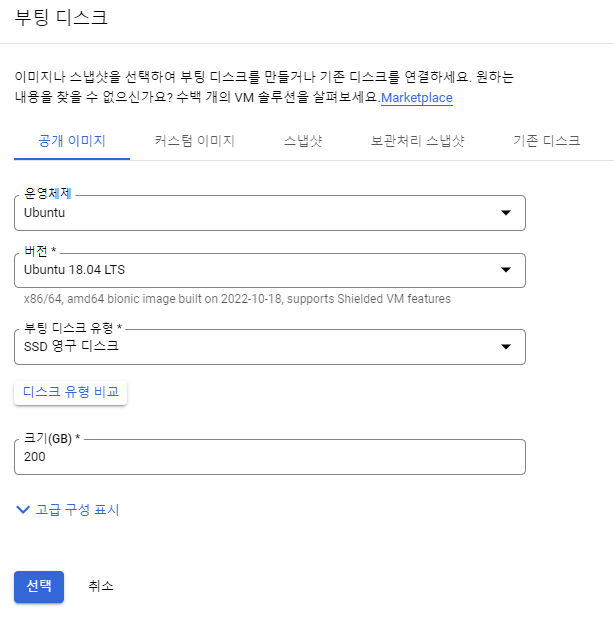

# 1.0 시작하기

## **1. 스터디 교재** &#x20;

### 1.1 엘라스틱서치 실무 가이드

<figure><figcaption></figcaption></figure>

## 2. 참고자료

### 2.1 ElasticSearch 클러스터 환경 구성 및 기본 실습

* 강의명 : 처음부터 시작하는 elastic
* 동영상 강의 : [https://www.youtube.com/watch?v=Ks0P49B4OsA\&list=PLhFRZgJc2afp0gaUnQf68kJHPXLG16YCf](https://www.youtube.com/watch?v=Ks0P49B4OsA\&list=PLhFRZgJc2afp0gaUnQf68kJHPXLG16YCf)
* 참고 자료 : [https://esbook.kimjmin.net/](https://esbook.kimjmin.net/)

